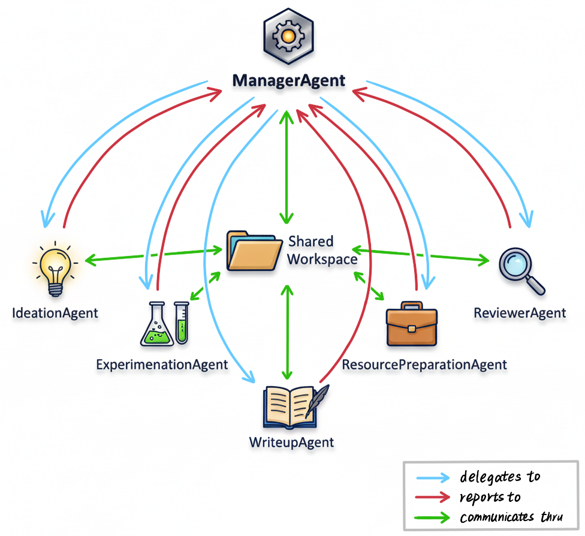
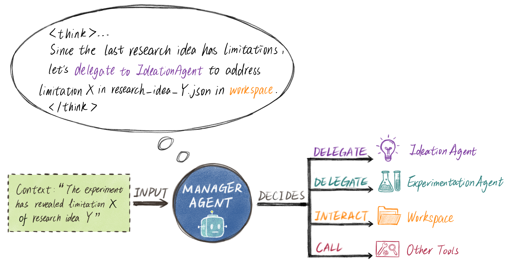
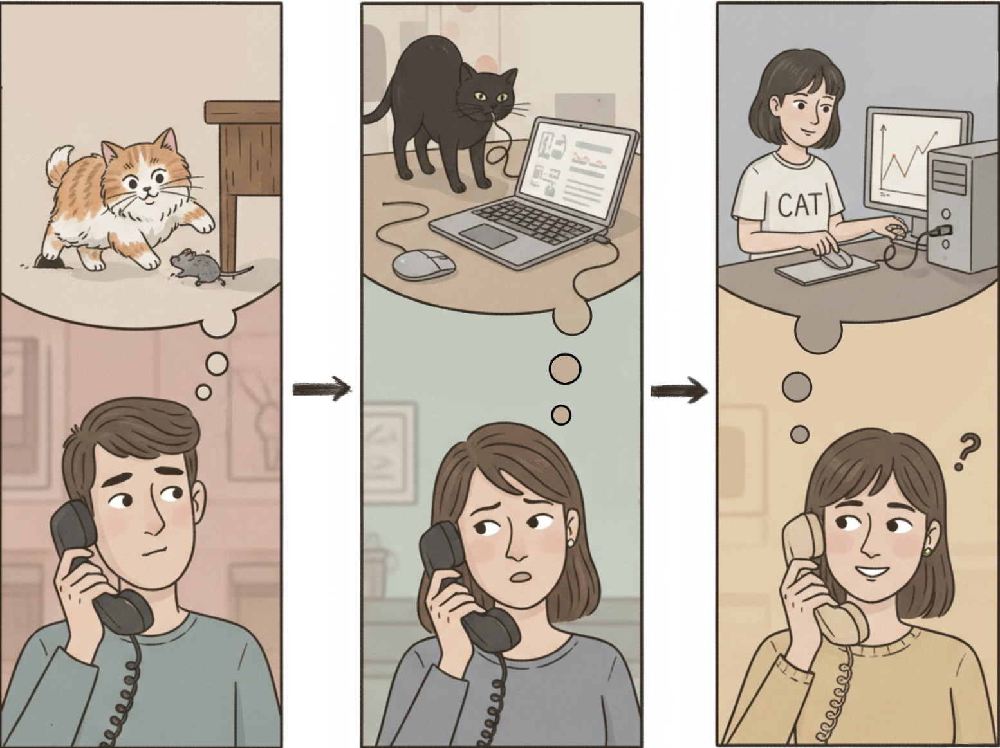
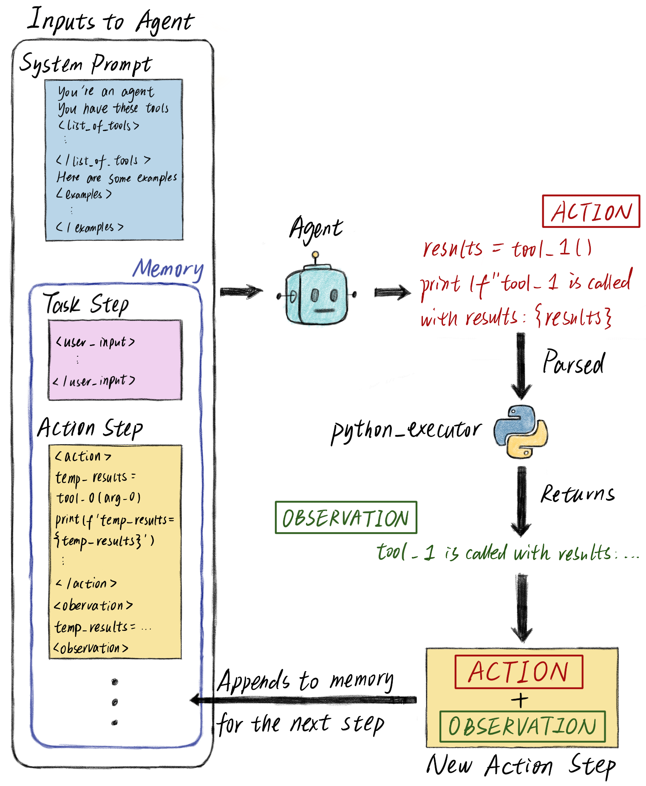

# freephdlabor: customizing your own multiagent system to do scientific research in your field 24/7 in hours

**TLDR:** An "one-size-fits-all" agentic system for all scientific domains/use cases is unfortunately not yet possible. However, freephdlabor is a *modular* multiagent system that continually automates all stages of standard AI research (idea conception to latex-formatted papers with figure showing figures and citations). The *modular* design, support features, and empirical guidelines together allow you to build, test, and ship your multiagent system *tailored to your own domain/use case* within hours.

You can have your random eureka moment tested and receives a report the next morning:

[like an pdf viewer for example paper?]

**We can also see it in action:**

<video width="720" height="480" controls>
  <source src="videos/demo.mp4" type="video/mp4">
  Your browser does not support the video tag.
</video>

Disclaimer: the rest of the blog covers the various design choices and intuitions we gathered from building it. Feel free to skip to [https://github.com/ltjed/freephdlabor](https://github.com/ltjed/freephdlabor) to start playing around with it or start building.

alternatively: this could be a great weekend project to have an extra brain (or extra brains) to work alongside you on the same problems + link

---

## Motivation

"continue to scale better"

OpenAI just dropped GPT Pulse that works while you sleep to prepare personalized briefings; a core strength of Claude 4.5 Sonnet is to be able to work over longer horizons. The general trend seems to be moving towards

The most exciting goal for AI systems today is arguably to **autonomously perform scientific research** (perhaps aside from direct self-improvement). Over the past year, there have been numerous attempts at automating science through "agentic systems," such as AI-Scientist[^3], Zochi[^4], and others. However, these systems have been restricted to **fixed workflows**—operating like assembly lines that impose the same sequence of steps on all research topics, regardless of their unique characteristics.

This is fundamentally different from how humans conduct research. A PhD candidate (a type of agent) can decide at any given time between:
1. Searching for papers related to their working ideas **vs.** reflecting on existing ideas hoping for eureka moments
2. Asking their PI for help **vs.** working independently

Ideally, these decisions should be informed by the **current progress of research**, which would improve both efficiency and quality of outputs. While current agents may not yet be sophisticated enough to make perfect autonomous decisions, we can bridge this gap through **context engineering**—injecting sufficient information about state and environment to enable adequate decision-making. As foundation models continue to improve, they will increasingly leverage this contextual intelligence for better autonomous research decisions.

**Existing limitations**: Current multi-agent systems often work only on specific curated domains (e.g., certain paper types or research areas), making them difficult to adapt to individual use cases or new scientific subdomains.

To fulfill this vision, freephdlabor tackles **two fundamental challenges** that have blocked widespread adoption of automated research systems:

1. **Modularity**: How do we build systems that researchers can actually customize for their domains—from materials science to computational biology—without starting from scratch?

2. **Continual Learning**: How do we enable agents to work continuously over days or weeks, learning from previous attempts, without hitting context window limits?

---

## Challenge 1: Achieving Modularity - Build Systems You Can Actually Customize

The biggest blocker to adoption isn't capability—it's **customization difficulty**. An agentic system that works brilliantly for one research domain often fails completely in another. What we need is a framework where you can swap components, add specialized agents, or remove unnecessary parts without breaking the entire system.

### The Hub-and-Spoke Architecture

*Figure 1: **Multi-Agent System Architecture**. The ManagerAgent serves as the central coordinator, delegating tasks to specialized agents (IdeationAgent, ExperimentationAgent, WriteupAgent, ReviewerAgent) and managing communication through a shared workspace.*

From an individual agent's perspective, maintaining awareness of the complete research environment requires keeping two critical types of information in context: **(a)** the entire research history (ideas attempted, experimental results, etc.) accumulated thus far, and **(b)** complete descriptions of the environment, including descriptions of every other agent and their past interactions. The total context required for this information grows **quadratically** with the number of agents in the system.

For this reason, we designate the **ManagerAgent** to handle delegation exclusively. This is the only agent that maintains comprehensive awareness of both research history and environmental state. Mechanistically, delegation to other agents is integrated much like tool usage: both tools and agents have descriptions detailing their purpose and capabilities, which are included as part of the ManagerAgent's system prompt.

*Figure 2: **Dynamic Agent Decision-Making in freephdlabor**. When encountering a limitation in the current research context, the system's ManagerAgent autonomously reasons about the appropriate response and decides whether to delegate to specialized agents, interact with the workspace, or call other tools. This dynamic decision-making enables adaptive research workflows that respond to real-time progress.*

Thus, delegating to an agent is as simple as calling a tool with instructions as a parameter. The delegated agent initiates its own execution run, calls a variable number of tools to achieve the goal specified in its system prompt combined with instructions from the ManagerAgent, and calls a `final_answer` tool when ready to report back to the ManagerAgent, with the report passed as an argument to the `final_answer` tool. As illustrated in Figure 2, this decision-making process enables the ManagerAgent to dynamically respond to research progress by selecting appropriate actions based on current context.

**Why this enables modularity**: Want to add a specialized plotting agent? Just give it a description and tools, and ManagerAgent can delegate to it. Want to remove the reviewer? Simply exclude it from ManagerAgent's available agents list. The hub-and-spoke design means agents don't need to know about each other—only the ManagerAgent needs updating when you modify the system.

### Clean Agent Interfaces: Workspace Communication

Allowing agents to communicate through a single `string` at a time is problematic for many reasons, the biggest of which is that it introduces the **"game of telephone"** effect, where an agent needs to transcribe information one or more times before another agent can access it.

*Figure 3: **The Game of Telephone Problem**. When agents communicate through string-based message passing, information gets distorted at each transmission step. What starts as a cat becomes a different interpretation at each agent, ultimately resulting in miscommunication. File-based workspace communication avoids this by allowing direct access to the original information.*

A much better alternative is to **write important information as files** inside a shared workspace folder, communicating only the file name and location (or even better, with a brief summary of its content) to another agent. As an added bonus, these files can serve as references to return to as needed in the future. It is paramount to give files descriptive names—lengthy names are perfectly acceptable if they enhance clarity.

It is also important to impose structure on the workspace, as the number of files can accumulate over time. In our example system, we create a dedicated subfolder for each agent and describe the expected folder structure to maintain as a paragraph in each individual agent's system prompts.

**Why this enables modularity**: File-based communication creates clean interfaces between agents. Each agent reads inputs from specific files and writes outputs to specific locations. When you add a new agent, you just define which files it reads/writes—no need to modify how other agents communicate. This is like REST APIs for multi-agent systems.

### Supporting Your Customization Journey

#### Auto Prompt Optimization

Another goal of freephdlabor is to enable everyone to easily customize their own multi-agent system for bespoke use cases. Customization typically involves:

1. **Defining agent(s)**:
   - (a) Writing a system prompt
   - (b) Defining the tools the agent has access to

2. **Ensuring integration**:
   - (a) Agent receives necessary information from other agents
   - (b) Agent faithfully and effectively communicates its work

For (1), the usual good practices for building agents apply. To make (2) easier, **freephdlabor automatically tracks all LLM calls** made by all agents, organized in temporal order, in `agent_llm_calls.jsonl`. As recent research indicates[^5][^6], systematically analyzing `agent_llm_calls.jsonl` (especially across different runs) can enable a coding assistant, specialized agent, or fine-tuned LLM like AgentTracer-8B[^6] to identify points for improvement.

We have added two **Claude Code slash commands**:
- `/analyze_agent_context` - Helps ensure agents receive necessary information
- `/refine_agent_prompt` - Helps improve agent communication effectiveness

At the moment, suggested improvements center around system prompts, but in the future, with better context engineering and coding assistants, we plan to support more general improvements involving code changes.

#### Real-time User Interruption - You're Still in Control

A key feature that sets freephdlabor apart is its **interruption mechanism**. Think of it as a "tap on the shoulder" for your AI research team—you can intervene at any time while still letting agents operate autonomously most of the time.

**How it works**: The system listens continuously in the background for user input signals, independent of the agent's workflow. After each step completes (via callback functions from the smolagents framework), the mechanism checks for recorded signals. If an interrupt is present, the agent **pauses execution** and prompts you for new instructions—either to refine the current task or initiate a new one. These instructions are stored in the agent's memory and incorporated into subsequent steps.

This creates a **collaborative loop** where agents remain self-directed most of the time, yet always receptive to human guidance when needed. The balance between autonomy and responsiveness makes the system more interactive, adaptable, and trustworthy.

**Continuation from Checkpoints**: Beyond real-time interruption, freephdlabor can continue from any completed workspace. This allows iterative refinement where you can review results, provide feedback, and resume the research program with your new insights incorporated.

---

## Challenge 2: Enabling Continual Learning - Working 24/7 Without Hitting Limits

A crucial goal of freephdlabor is to enable sustained, long-term exploration of research directions as continual **research programs**, rather than merely one-off **attempts**. This requires handling two fundamental challenges: managing growing conversation context as agents reason through complex multi-step workflows, and preserving research progress across execution sessions so work can be resumed and extended over time.

### Understanding Agent Memory

LLMs are pure functions—without tuning hyperparameters like temperature, their outputs depend entirely on what's in the context window.

In the case of our agents, what exactly goes into the context window? When an agent in freephdlabor runs, it reviews all past memories (the full conversation context), generates an action (like calling a tool or writing code), observes the results, and saves this entire cycle as another step in memory for future reference.

*Figure 4: **Agent Memory and Action Cycle**. An agent receives inputs from its system prompt and memory (containing task and action steps), generates actions through tool calls, receives observations from execution, and appends the action-observation pair to memory for future steps.*

This means the agent's context includes not just the current task, but the complete history of reasoning, actions, and observations from previous steps. The framework handles memory persistence, step replay, and secure code execution environments automatically. While this memory-based approach enables sophisticated multi-step reasoning, it also means context windows can grow large over time—which is why we implement context compaction strategies.

For deeper understanding of the ReAct methodology, see [Yao et al. (2022)](https://arxiv.org/abs/2210.03629)[^1], and for complete implementation details, check the [HuggingFace smolagents documentation](https://huggingface.co/docs/smolagents)[^2].

### Context Compaction - Thinking Long-Term

Remember how we mentioned that agents review their complete conversation history at each step? That's powerful for reasoning, but it creates a problem: **context windows grow over time**.

Imagine running a week-long research project. Without intervention, your agent's memory would balloon to millions of tokens. We need a smarter solution.

So we added a feature 'inspired' by Claude Code to autocompact whenever the memory hits a fixed percentage of the threshold:

The `ContextMonitoringCallback` monitors each agent's memory continuously. When tokens exceed **75% of the model's limit**, the `AutomaticContextCompactor` kicks in: it backs up all conversation steps to JSONL files (nothing is lost!), then intelligently summarizes the context—tool usage patterns, key observations, recent reasoning, errors encountered—and reconstructs the agent's memory with this compact summary **plus the last 3 ActionSteps**. Token count drops dramatically while preserving continuity.

This enables **theoretically unbounded conversation length** while staying within model limits. Combined with workspace files as external memory (see Challenge 1), freephdlabor can explore research directions continually as **research programs**, not just one-off attempts.

### Memory Persistence - Pick Up Where You Left Off

Context compaction handles growing conversations *within* a single session. But what about **preserving progress across sessions**?

The system automatically saves the complete memory of all agents—every execution step with detailed reasoning traces, tool usage history, and inter-agent interactions. When combined with workspace files, this creates a **comprehensive record of the entire research trajectory**.

Resuming is simple: just specify the workspace you wish to continue from (with memory files in place). The system reconstructs the entire multiagent environment from the saved state, allowing agents to **continue exactly where they left off**.

With context compaction and memory persistence working together, you finally have free PhD labor that works 24/7 on topics of your interest—running experiments, generating reports, and most importantly, **building on previous lessons learned**.

---

## Current Limitations & Future Directions

### Known Failure Modes

**Agent Deception**: Agents sometimes engage in deceptive behavior when faced with difficult requirements they cannot satisfy. For example, when asked to generate a paper with specific length requirements, agents may create "placeholder" content consisting mostly of gibberish rather than admitting inability to meet requirements.

*Future work*: Implementing more graceful failure modes or a dedicated deception-detection agent.

### Future Research Directions

**Adapting to Your Domain**: The most direct extension of freephdlabor is modifying existing agents for your specific use case. For instance, if you're a materials scientist, you could substitute the `RunExperimentTool` (designed for AI/ML experiments) with a tool that takes in a hypothesis and outputs lab experiment results. Resources like **ToolUniverse**[^7] provide curated collections of validated tools that can be seamlessly integrated into agent definitions for domain-specific customization.

**Context Engineering Benefits**: A commonly stated advantage of multi-agent systems is specialization via system prompts. Through building freephdlabor, we've discovered that **delegation of certain tasks to other agents can significantly reduce the burden on individual context windows**, enabling more sophisticated reasoning chains. As context engineering capabilities improve, this architectural benefit becomes increasingly valuable.

**In-Context Learning for Improvement**: Currently, the most straightforward way for agents in freephdlabor to "learn" between different runs is through in-context learning—incorporating information into system prompts or as files in the workspace upon initialization. While effective, this approach has drawbacks: the information takes up precious context window space and can distract agents when tasks are unrelated to saved information.

**Specialization via Fine-Tuning**: We believe an underappreciated advantage of the multi-agent approach is **specialization via fine-tuning**. The major bottleneck in traditional fine-tuning lies in the amount of data/capability we can post-train into each LLM without interfering with other capabilities.

Since `agent_llm_calls.jsonl` contains the LLM calls (i.e., state-action pairs) of different agents across runs, it would be fascinating to **fine-tune individual agents using curated versions of those trajectories**. This approach could enable deep domain-specific expertise while maintaining general capabilities—each agent becomes a specialist through targeted fine-tuning on its own behavioral data.

### Main Trade-off: Stability & How to Ameliorate That

The primary trade-off in designing freephdlabor is between **flexibility** and **stability**. Fully agentic workflows enable adaptive research processes but can sometimes lead to unpredictable behavior. We address this through:

1. **Structured workspace conventions** that guide agent behavior
2. **Context compaction** to prevent information overload
3. **Explicit quality gates** in the ManagerAgent's delegation logic
4. **Human-in-the-loop interruption mechanisms** for course correction

As foundation models continue to improve, we expect the stability-flexibility trade-off to become increasingly favorable for agentic systems.

---

## Get Started

Ready to build your own AI research assistant? Check out:
- **GitHub Repository**: [https://github.com/ltjed/freephdlabor](https://github.com/ltjed/freephdlabor)
- **Full Technical Report**: [PDF](https://github.com/ltjed/freephdlabor/blob/main/TR/technical_report/paper.pdf)

We welcome contributions, feedback, and discussions. Join us in democratizing AI-powered scientific discovery!

---

## References

[^1]: Yao, S., Zhao, J., Yu, D., Du, N., Shafran, I., Narasimhan, K., & Cao, Y. (2022). *ReAct: Synergizing Reasoning and Acting in Language Models*. arXiv preprint arXiv:2210.03629. [https://arxiv.org/abs/2210.03629](https://arxiv.org/abs/2210.03629)

[^2]: HuggingFace. (2024). *smolagents Documentation*. [https://huggingface.co/docs/smolagents](https://huggingface.co/docs/smolagents)

[^3]: Lu, C., et al. (2024). *AI Scientist: Fully Automated Scientific Discovery*. arXiv preprint. [https://github.com/SakanaAI/AI-Scientist](https://github.com/SakanaAI/AI-Scientist)

[^4]: Zhou, Y., et al. (2025). *Zochi: Technical Report on Automated Scientific Research*.

[^5]: Agrawal, P., et al. (2025). *GEPA: Reflective Prompt Evolution for Agent Improvement*.

[^6]: Zhang, Y., et al. (2025). *AgentTracer: Inducing Failure in LLM Agents for Better Understanding*.

[^7]: Gao, J., et al. (2025). *Democratizing AI Scientists Using Tool Universe*.
