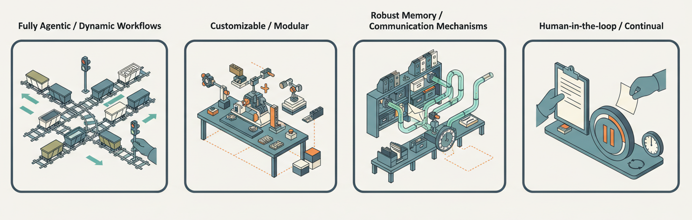
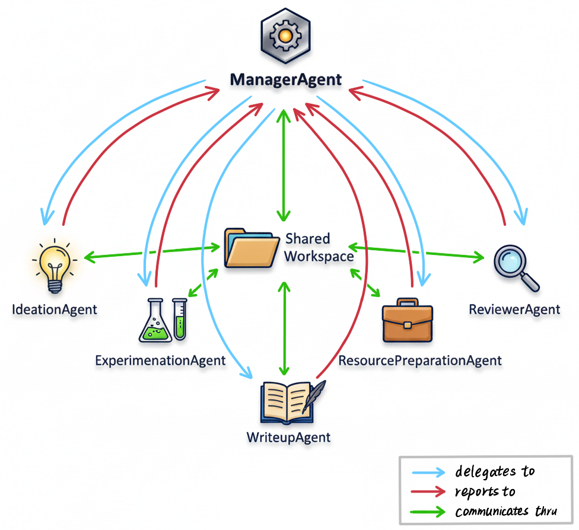
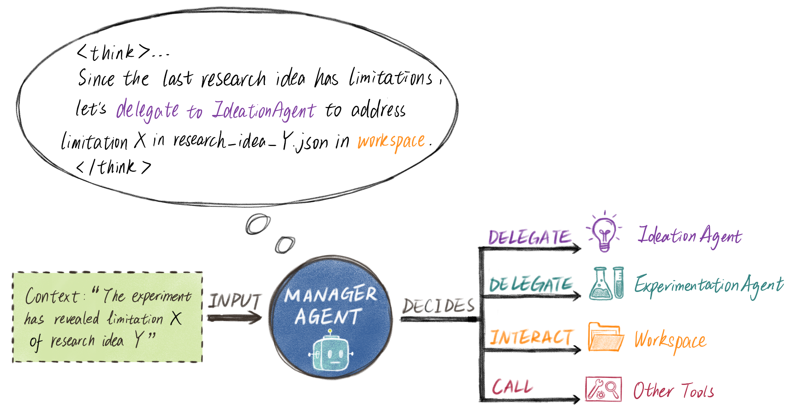
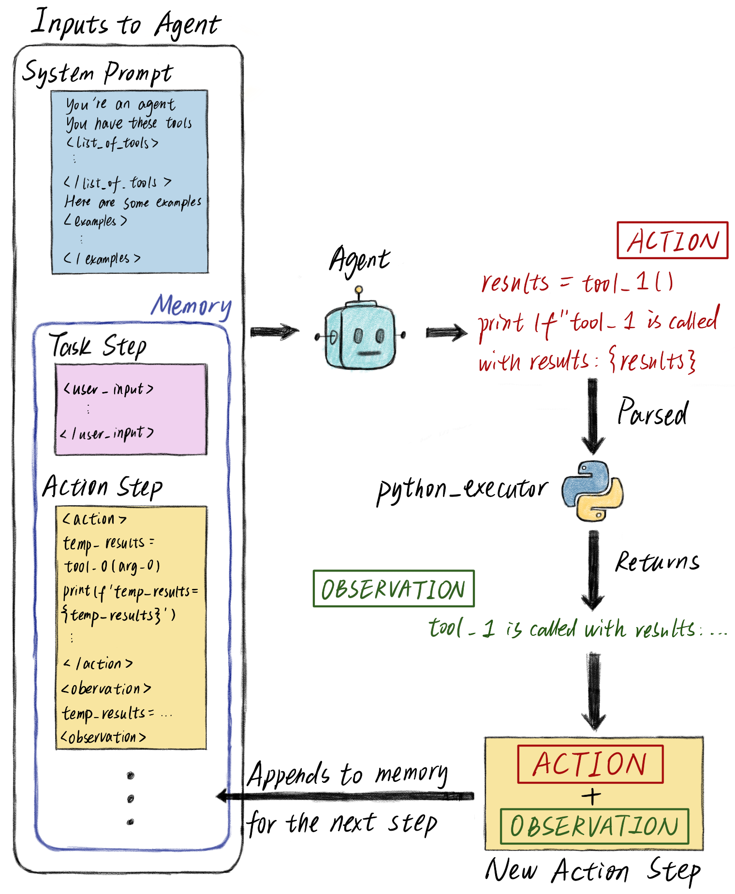
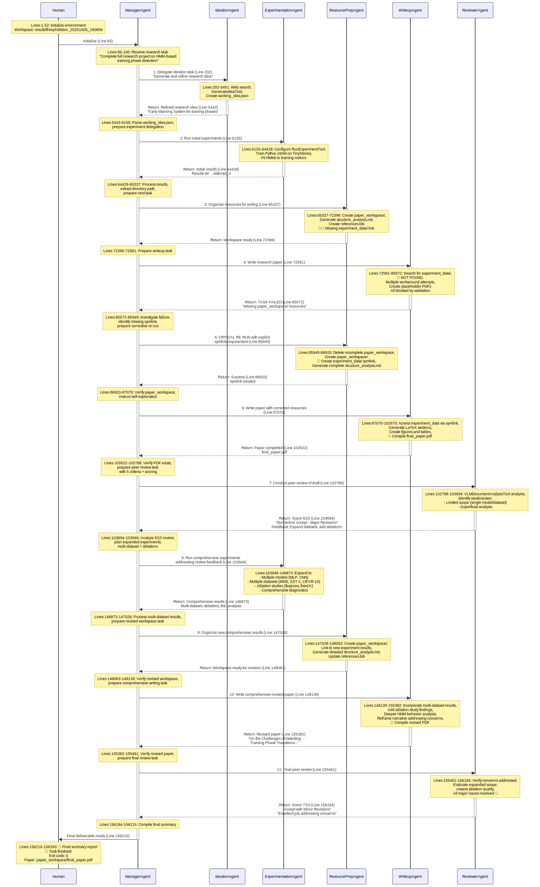

<style>
body {
  font-size: 22px !important;
  line-height: 1.9 !important;
}

h1 {
  font-size: 1.8em !important;
  line-height: 1.3 !important;
}

h2 {
  font-size: 1.4em !important;
  margin-top: 2.5em !important;
  line-height: 1.4 !important;
}

h3 {
  font-size: 1.2em !important;
  line-height: 1.5 !important;
}

p, li {
  font-size: 22px !important;
  line-height: 1.9 !important;
}

blockquote p {
  font-size: 22px !important;
}

/* Also increase code font size */
code {
  font-size: 20px !important;
}

pre code {
  font-size: 18px !important;
}

/* Ensure code in headings inherits heading size */
h1 code {
  font-size: 0.9em !important;
}

h2 code {
  font-size: 0.9em !important;
}

h3 code {
  font-size: 0.9em !important;
}

/* Style for <code> tags - just monospace font, no background or color change */
code:not([class]) {
  background-color: transparent !important;
  color: inherit !important;
  padding: 0 !important;
  border: none !important;
  font-weight: bold !important;
  font-size: 1em !important; /* Ensure same size as surrounding text */
}
</style>

# `freephdlabor`: customizing your own research lab to do scientific research in your field 24/7

<p align="center">
  <a href="https://github.com/ltjed/freephdlabor">
    
  </a>
  <a href="https://github.com/ltjed/freephdlabor">
    
  </a>
  <a href="https://arxiv.org/abs/2510.15624">
    
  </a>
</p>

**TLDR:** An "one-size-fits-all" agentic system for all scientific domains/use cases is unfortunately not yet possible. However, `freephdlabor` is the ***first fully customizable*** open-source multiagent framework with *dynamic workflow* to continually automate *all* stages of research (idea conception to latex-formatted papers with figures and citations). The modular design, support features, and empirical guidelines together allow you to **build, test, and ship your multiagent system tailored to your own domain/use case within hours**.



You can customize your own `freephdlabor`, allowing you to give it half-baked research hypotheses (e.g., *"can we predict neural network training phases?"*) in the evening and wake up to a full paper with **real** experiments and citations:

<embed src="papers/example_paper.pdf" type="application/pdf" width="100%" height="600px" />

**We can also see it in action:**

<iframe width="100%" height="600" src="https://www.youtube.com/embed/xwG7dpUtues" frameborder="0" allow="accelerometer; autoplay; clipboard-write; encrypted-media; gyroscope; picture-in-picture" allowfullscreen></iframe>

A great weekend project would be to **customize our system for yourself**—once running, you'll have extra brains (or entire research teams) **working alongside you 24/7** on the same problems you care about: [github.com/ltjed/freephdlabor](https://github.com/ltjed/freephdlabor)

---
## Generating useful scientific slop

The most exciting goal in AI today is arguably to **accelerate scientific progress**, which holds the key to recursive self-improvement. A good first step towards such acceleration would be agentic systems that work 24/7 on your research problems—testing hypotheses while you sleep, exploring dead-ends so you don't have to, and delivering publication-grade reports that you can provide feedback on, much like directing your own research lab full of PhD students.

Despite recent work has shown exciting promise, such a dream assistant remains out of reach. No existing system can flexibly adapt to any scientific subdomain while autonomously managing its context for sustained, long-term research programs.

In this blog, we will dive into how `freephdlabor` tackles the fundamental challenges preventing this vision, enabling you to build a customized AI research system for own research needs. We focus on key design principles and intuitions; for complete implementation and the full set of features, please refer to our [technical report](https://arxiv.org/abs/2510.15624).

---
## What's Holding Us Back

Over the past year, systems like `AI Scientist`[^1], `AI Scientist-v2`[^2], `Agent Laboratory`[^3], `Zochi`[^4], and `Robin`[^5] have demonstrated automated research in specific domains. However, these systems employ **fixed workflows**—operating like assembly lines that impose the same sequence of steps on all research topics (one exception is Google's `AI co-scientist`[^6], which allocate resources to different tasks/agents a priori, but it was never made open-source).

To get closer to the vision of truly adaptive AI research assistants, we need to address fundamental challenges:

- **Workflow Flexibility**: While fixed workflows reduce variability and make systems less prone to errors, they prevent customization: a pipeline designed for ML experiments can't easily adapt to your specific research area without significant re-engineering.

- **Context Window Limitations**: LLMs are pure functions—without tuning hyperparameters like temperature, their outputs depend entirely on what's in the context window. Long-running autonomous research generates massive amounts of information—experiment results, literature notes, failed attempts, insights. As agents work over hours or days, they need the right information at the right time in their context window. Without proper context management, agents either suffer from context bloat or miss critical details.

- **Multiagent Coordination**: From an individual agent's perspective, it needs to keep track of **(a)** the entire research history (ideas attempted, experiment results, etc.) accumulated thus far, and **(b)** complete description of the environment, which includes the description of every other agent. The total context this information requires grows **quadratically** with the number of agents. Additionally, allowing agents to communicate through a single <code>string</code> at a time introduces the **"game of telephone"** effect, where an agent needs to transcribe information one or more times before another agent can access it.

- **Human Intervention & Continual Research**: A commonly stated advantage of multi-agent systems is specialization via system prompts. However, effective long-term autonomous operation requires both human guidance at critical junctures and mechanisms to learn from past runs without polluting future contexts.

---
## Dynamic Workflows

To tackle the **Workflow Flexibility** challenge where fixed pipelines prevent customization, `freephdlabor` implements fully dynamic workflows that adapt to research progress. Building a customizable multiagent system requires clean interfaces and modular design, which we address through these key mechanisms:

### An Example Architecture



<!-- *Figure 1: **Multi-Agent System Architecture**. The <code>ManagerAgent</code> serves as the central coordinator, delegating tasks to specialized agents (<code>IdeationAgent</code>, <code>ExperimentationAgent</code>, <code>WriteupAgent</code>, <code>ReviewerAgent</code>) and managing communication through a shared workspace.* -->

*Note that arrows in the figure do not indicate workflows like figures in other work do, but rather options that are available for an agent to autonomously choose from.*

### <code>ManagerAgent</code> - PI of a Research Lab

For this reason, in our example system we designate a **<code>ManagerAgent</code>** to handle the delegation. This is the only agent that keeps track of both (a) the entire research history (ideas attempted, experimental results, etc.) in condensed form, and (b) complete descriptions of all other agents in the environment. Mechanistically, delegation to other agents is integrated much like a tool: both tools and agents have a description detailing their purpose, capabilities, etc., which are included as part of the <code>ManagerAgent</code>'s system prompt.



<!-- *Figure 3: **Dynamic Agent Decision-Making in freephdlabor**. When encountering a limitation in the current research context, the system's <code>ManagerAgent</code> autonomously reasons about the appropriate response and decides whether to delegate to specialized agents, interact with the workspace, or call other tools. This dynamic decision-making enables adaptive research workflows that respond to real-time progress.* -->

Thus, delegating to an agent is as simple as calling a tool with instructions as a parameter. The delegated agent will start a run of its own, call a variable number of tools to achieve the goal specified in its system prompt plus instructions from <code>ManagerAgent</code>, and call the <code>final_answer</code> tool when ready to report back to <code>ManagerAgent</code>, with the report passed as an argument to the <code>final_answer</code> tool.

This *hub-and-spoke* design enhances both *modularity* and *communication*: agents communicate through a systematic central channel (the <code>ManagerAgent</code>) rather than ad-hoc peer-to-peer connections, making information flow more effective. Moreover, new agents only need to interface with the <code>ManagerAgent</code> rather than being integrated with every existing agent, vastly reducing the complexity of adding new capabilities to the system.

**Agent Specialization**: Each agent in our example system serves a distinct role in the research process, mirroring how humans organize research teams:
- The <code>IdeationAgent</code> functions as the research idea specialist, generating novel hypotheses through systematic literature analysis and gap identification
- The <code>ExperimentationAgent</code> serves as the experimental execution specialist, transforming research ideas into working code and producing concrete results with illustrations
- The <code>ResourcePreparationAgent</code> acts as the data librarian, organizing experimental artifacts and preparing resources before paper writing begins  
- The <code>WriteupAgent</code> operates as the academic writing specialist, transforming organized experimental results into publication-ready research papers
- The <code>ReviewerAgent</code> provides structured peer review feedback, enabling the <code>ManagerAgent</code> to decide whether to terminate or iterate further with revisions

---
## Context Management

To overcome both **Context Window Limitations** and the **Multiagent Coordination** challenges—including the quadratic scaling problem and "game of telephone" effect—we implement comprehensive context management strategies. Effective long-term autonomous operation requires managing both context length and ensuring that the right information is available at the right time.

### Workspace - File-Based Communication Channel/External Memory

A much better alternative is to **write important information as files** inside a shared workspace folder, communicating only the file path (or even better, with a brief summary of its content) to another agent. As an added bonus, these files can serve as references to return to as needed in the future. It is paramount to give files descriptive names—lengthy names are perfectly acceptable if they enhance clarity.


*The "game of telephone" effect when agents communicate through strings - avoided by using file-based communication. What starts as "a cat catching a mouse" becomes "a girl unplugging the input device mouse" after multiple agent-to-agent transcriptions.*

### Agent Memory

When an agent in freephdlabor runs, it reviews all past memories (the full conversation context), generates an action (like calling a tool or writing code), observes the results, and saves this entire cycle as another step in memory for future reference.



*Agents maintain a growing memory of reasoning, actions, and observations from each step*

This means the agent's context includes not just the current task, but the complete history of reasoning, actions, and observations from previous steps. The framework handles memory persistence, step replay, and secure code execution environments automatically[^9]. While this memory-based approach enables sophisticated multi-step reasoning, it also means context windows can grow large over time—which is why we implement multiple context management strategies.

### Context Compaction

Context compaction handles growing conversations *within* a single session. When tokens exceed **75% of the model's limit**, the <code>AutomaticContextCompactor</code> kicks in: it intelligently summarizes the context—tool usage patterns, key observations, recent reasoning, errors encountered—and reconstructs the agent's memory with this compact summary **plus the last 3 ActionSteps**.

### Workspace as External Memory

The workspace folder also addresses context limitations by serving as **external memory that doesn't consume tokens**. Important information—experiment results, intermediate analyses, literature reviews—lives in files rather than taking up precious context space. Agents can reference these files when needed, dramatically extending their effective memory capacity beyond the token limit when workspace in organized appropriately.

With context compaction, memory persistence, and workspace-based external memory working together, you finally have free PhD labor that works 24/7 on topics of your interest—running experiments, generating reports, and most importantly, **building on previous lessons learned**.

---
## Modular Agent Specialization

To address both **Context Window Limitations** and **Multiagent Coordination** challenges, we employ modular agent specialization. By distributing work across specialized agents, we avoid the quadratic context scaling problem while ensuring each agent has precisely the information it needs. Each specialized agent concentrates on designated work with specific tool sets and fewer choices, reducing distraction and improving focus.

**Tool Specialization**: Each agent in the system has access to a curated set of tools relevant to its specific role. For instance:
- The <code>IdeationAgent</code> focuses on literature search and hypothesis generation tools
- The <code>ExperimentationAgent</code> works with code execution and experiment management tools
- The <code>WriteupAgent</code> specializes in LaTeX compilation and figure generation tools
- The <code>ReviewerAgent</code> uses critical analysis and validation tools

**Reduced Distraction**: By limiting each agent to its domain-specific responsibilities and tools, we minimize cognitive overhead. An agent writing papers doesn't need to know about experiment execution details, and an agent running experiments doesn't need LaTeX formatting knowledge. This separation of concerns allows each agent to excel in its specialized domain without the noise of irrelevant capabilities.

**Context Window Benefits**: Through building freephdlabor, we've discovered that **delegation of certain tasks to other agents can significantly reduce the burden on individual context windows**, enabling more sophisticated reasoning chains. This specialization approach not only improves individual agent performance but also makes the system more maintainable and debuggable—when something goes wrong, it's clear which agent and which subset of tools are involved.

**Encoded Research Wisdom**: Beyond managing context size, specialization allows us to embed domain expertise directly into each agent's context through carefully crafted system prompts. Unlike rigid workflows, these prompts provide flexible guidance—accumulated wisdom that agents consider but can override when the situation demands:

- The <code>IdeationAgent</code> carries experience about what makes strong research contributions: genuine literature gaps, theoretical grounding, testable hypotheses—but remains open to unconventional ideas that break these patterns
- The <code>ExperimentationAgent</code> draws on best practices like ablation studies and baseline comparisons, yet adapts its approach based on what each unique research question requires
- The <code>WriteupAgent</code> understands effective paper narratives while remaining flexible to present results in whatever structure best serves the findings
- The <code>ReviewerAgent</code> considers multiple evaluation dimensions (originality, soundness, clarity, significance) but weighs them dynamically based on the paper's goals

This isn't hardcoded behavior—it's more like giving agents the benefit of experience. When you customize for your domain, you're sharing field-specific wisdom that guides without constraining. A biology agent might know "controls typically isolate variables" but recognize when a systems approach demands different methodology. This flexible expertise is what enables agents to handle novel research directions while still making informed decisions.



*Sequence diagram demonstrating how specialized agents interact in an example `freephdlabor` run*

---
## Collaborative Evolution

To address the **Human Intervention & Continual Research** challenge, we built mechanisms for both real-time human guidance and learning across research sessions.

### Making Customization Easy

Another goal of `freephdlabor` is to enable everyone to easily customize their own multiagent system for bespoke use cases. This involves writing system prompts, defining tools, ensuring agents receive necessary information from other agents, and ensuring they communicate their work effectively. Traditionally, this requires extensive trial-and-error to get agents working well together.

`freephdlabor` makes this process largely automatic. The system **automatically tracks all LLM calls** made by all agents, organized in temporal order, creating a comprehensive interaction log in <code>agent_llm_calls.jsonl</code>. This eliminates the guesswork: instead of manually debugging why agents aren't collaborating well, you can systematically analyze their actual interactions.

To address these integration challenges, we provide **custom Claude Code slash commands** (available in the repository's <code>.claude/commands/</code> directory):
- <code>/analyze_agent_context</code> - Automatically identifies when agents lack necessary information from other agents
- <code>/refine_agent_prompt</code> - Suggests specific improvements to enhance agent communication effectiveness

Used together, these commands ensure agents receive necessary information and communicate effectively.

As recent research indicates[^7][^8], systematically examining these LM call traces—especially across different runs—enables coding assistants and fine-tuned LLMs like AgentTracer-8B[^8] to identify key improvement opportunities. Users can focus on the creative work of defining agent roles and selecting appropriate tools, while the system provides intelligent guidance for integration challenges.

### Towards continual collaboration

An important goal of `freephdlabor` is to enable **continual research** of the same topic while allowing plenty of interaction between you and your own 'research lab.'

To this end, the system automatically saves the complete memory of all agents—every execution step with detailed reasoning traces, tool usage history, and inter-agent interactions. When combined with workspace files, this creates a comprehensive record of the entire research trajectory. **Resuming from checkpoints** is simple: specify the workspace you wish to continue from, and the system reconstructs the entire multiagent environment from the saved state.

**Real-time interruption** enables interactive context injection when needed. The system listens continuously for user input signals. After each step completes, if an interrupt is present, the agent pauses and prompts you for new instructions—either to refine the current task or inject critical context the agent may have missed. These instructions are stored in agent memory and incorporated into subsequent steps.

This creates a **collaborative loop** where agents remain self-directed most of the time, yet always receptive to human guidance when needed.

### Current Learning Mechanisms

**In-Context Learning**: Currently, agents in freephdlabor "learn" between different runs through in-context learning—incorporating information into system prompts or as files in the workspace upon initialization. This enables agents to build on previous research sessions and avoid repeating failed approaches.

---
## Implementation Considerations

### Flexibility v. Stability

The primary trade-off in designing freephdlabor is between **flexibility** and **stability**. Fully agentic workflows enable adaptive research processes but can sometimes lead to unpredictable behavior. We address this through:

1. **Structured workspace conventions** that guide agent behavior
2. **Context compaction** to prevent information overload
3. **Explicit quality gates** in the <code>ManagerAgent</code>'s delegation logic
4. **Human-in-the-loop interruption mechanisms** for course correction

---
## Future Directions

**Advanced Context Engineering**: As foundation models develop better context management capabilities, we expect multiagent architectures to become even more powerful. Future context engineering advances could enable more sophisticated delegation patterns, smarter memory allocation across agents, and dynamic context sharing strategies that further amplify the benefits of specialized agent coordination.

**Adapting to Your Domain**: The most direct extension of freephdlabor is modifying existing agents for your specific use case. For instance, if you're a materials scientist, you could substitute the <code>RunExperimentTool</code> (designed for AI/ML experiments) with a tool that takes in a hypothesis and outputs lab experiment results. Resources like `ToolUniverse`[^10] provide curated collections of validated tools that can be seamlessly integrated into agent definitions for domain-specific customization.

**In-Context Learning for Improvement**: While effective, the current in-context learning approach has drawbacks: the information takes up precious context window space and can distract agents when tasks are unrelated to saved information. Future improvements could address these limitations through more sophisticated context management.

**Specialization via Fine-Tuning**: We believe an underappreciated advantage of the multiagent approach is **specialization via fine-tuning**. The major bottleneck in traditional fine-tuning lies in the amount of data/capability we can post-train into each LLM without interfering with other capabilities.

Since <code>agent_llm_calls.jsonl</code> contains the LLM calls (i.e., state-action pairs) of different agents across runs, it would be fascinating to **fine-tune individual agents using curated versions of those trajectories**. This approach could enable deep domain-specific expertise while maintaining general capabilities—each agent becomes a specialist through targeted fine-tuning on its own behavioral data.

**Agent Deception**: Agents sometimes engage in deceptive behavior when faced with difficult requirements they cannot satisfy. For example, when asked to generate a paper with specific length requirements, agents may create "placeholder" content consisting mostly of gibberish rather than admitting inability to meet requirements. Moreover, as seen in the demo video run for <code>ResourcePreparationAgent</code> in the first run, sometimes agents may just make a mistake and don't realize it. Regardless, improving reliability via dedicated agents, prompting, or post-training are all viable options.

**Foundation Model Improvements**: As foundation models continue to improve, we expect the stability-flexibility trade-off to become increasingly favorable for agentic systems. At the moment, suggested improvements center around system prompts, but in the future, with better context engineering and coding assistants, we plan to support more general improvements involving code changes.

---
## Taking stock...

*AI-accelerated innovation shouldn't belong only to Google*. `freephdlabor` is a step toward this vision: a multiagent framework where **modularity enables customization** and **context engineering enables persistence**, further *closing the gap between compute hours and scientific innovation*.

Ready to build your own AI research team? Check out:
- **GitHub Repository**: [https://github.com/ltjed/freephdlabor](https://github.com/ltjed/freephdlabor)
- **Full Technical Report**: [arXiv:2510.15624](https://arxiv.org/abs/2510.15624)

We welcome contributions, feedback, and discussions. Join us in democratizing AI-powered scientific discovery!

---

## Citation

If you find this work useful, please cite:

```bibtex
@article{li2025freephdlabor,
  title={Build Your Personalized Research Group: A Multiagent Framework for Continual and Interactive Science Automation},
  author={Li, Ed and Ren, Junyu and Pan, Xintian and Yan, Cat and Li, Chuanhao and Bergemann, Dirk and Yang, Zhuoran},
  journal={arXiv preprint arXiv:2510.15624},
  year={2025},
  url={https://arxiv.org/abs/2510.15624}
}
```

## References

[^1]: Lu, C., et al. (2024). *AI Scientist: Fully Automated Scientific Discovery*. arXiv preprint arXiv:2408.06292. [https://arxiv.org/abs/2408.06292](https://arxiv.org/abs/2408.06292)

[^2]: Yamada, Y., Lange, R. T., Lu, C., Hu, S., Lu, C., Foerster, J., Clune, J., & Ha, D. (2025). *The AI Scientist-v2: Workshop-Level Automated Scientific Discovery via Agentic Tree Search*. arXiv preprint arXiv:2504.08066. [https://arxiv.org/abs/2504.08066](https://arxiv.org/abs/2504.08066)

[^3]: Schmidgall, S., Su, Y., Wang, Z., Sun, X., Wu, J., Yu, X., Liu, J., Moor, M., Liu, Z., & Barsoum, E. (2025). *Agent Laboratory: Using LLM Agents as Research Assistants*. arXiv preprint arXiv:2501.04227. [https://arxiv.org/abs/2501.04227](https://arxiv.org/abs/2501.04227)

[^4]: Zhou, Y., et al. (2025). *Zochi: Technical Report on Automated Scientific Research*. [https://github.com/IntologyAI/Zochi/blob/main/Zochi_Technical_Report.pdf](https://github.com/IntologyAI/Zochi/blob/main/Zochi_Technical_Report.pdf)

[^5]: Lu, Y., Wang, C., Song, L., & Li, H. (2025). *Robin: A Multi-Agent System for Automating Scientific Discovery*. arXiv preprint arXiv:2505.13400. [https://arxiv.org/abs/2505.13400](https://arxiv.org/abs/2505.13400)

[^6]: Gottweis, J., Weng, W.-H., Daryin, A., Tu, T., Palepu, A., Sirkovic, P., et al. (2025). *Towards an AI co-scientist*. arXiv preprint arXiv:2502.18864. [https://arxiv.org/abs/2502.18864](https://arxiv.org/abs/2502.18864)

[^7]: Agrawal, P., et al. (2025). *GEPA: Reflective Prompt Evolution Can Outperform Reinforcement Learning*. arXiv preprint arXiv:2507.19457. [https://arxiv.org/abs/2507.19457](https://arxiv.org/abs/2507.19457)

[^8]: Zhang, Y., et al. (2025). *AgenTracer: Who Is Inducing Failure in the LLM Agentic Systems?* arXiv preprint arXiv:2509.03312. [https://arxiv.org/abs/2509.03312](https://arxiv.org/abs/2509.03312)

[^9]: HuggingFace. (2024). *smolagents Documentation*. [https://huggingface.co/docs/smolagents](https://huggingface.co/docs/smolagents)

[^10]: Gao, J., et al. (2025). *Democratizing AI scientists using ToolUniverse*. arXiv preprint arXiv:2509.23426. [https://arxiv.org/abs/2509.23426](https://arxiv.org/abs/2509.23426)