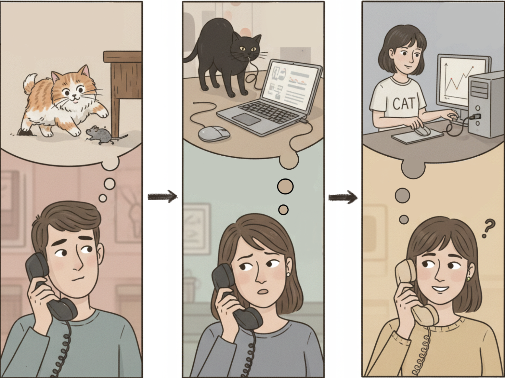

# freephdlabor: customizing your own multiagent system to do scientific research in your field 24/7 in hours

**TLDR:** An "one-size-fits-all" agentic system for all scientific domains/use cases is unfortunately not yet possible. However, freephdlabor is a *modular* multiagent system that continually automates all stages of standard AI research (idea conception to latex-formatted papers with figure showing figures and citations). The *modular* design, support features, and empirical guidelines together allow you to build, test, and ship your multiagent system *tailored to your own domain/use case* within hours.

You can have your random eureka moment tested and receives a report the next morning:

[like an pdf viewer for example paper?]

**We can also see it in action:**

<video width="720" height="480" controls>
  <source src="videos/demo.mp4" type="video/mp4">
  Your browser does not support the video tag.
</video>

Disclaimer: the rest of the blog covers the various design choices and intuitions we gathered from building it. Feel free to skip to [https://github.com/ltjed/freephdlabor](https://github.com/ltjed/freephdlabor) to start playing around with it or start building.

alternatively: this could be a great weekend project to have an extra brain (or extra brains) to work alongside you on the same problems + link
---
## Motivation

"continue to scale better"

OpenAI just dropped GPT Pulse that works while you sleep to prepare personalized briefings; a core strength of Claude 4.5 Sonnet is to be able to work over longer horizons. The general trend seems to be moving towards 

The most exciting goal for AI systems today is arguably to **autonomously perform scientific research** (perhaps aside from direct self-improvement). Over the past year, there have been numerous attempts at automating science through "agentic systems," such as AI-Scientist[^3], Zochi[^4], and others. However, these systems have been restricted to **fixed workflows**—operating like assembly lines that impose the same sequence of steps on all research topics, regardless of their unique characteristics.

This is fundamentally different from how humans conduct research. A PhD candidate (a type of agent) can decide at any given time between:
1. Searching for papers related to their working ideas **vs.** reflecting on existing ideas hoping for eureka moments
2. Asking their PI for help **vs.** working independently

Ideally, these decisions should be informed by the **current progress of research**, which would improve both efficiency and quality of outputs. While current agents may not yet be sophisticated enough to make perfect autonomous decisions, we can bridge this gap through **context engineering**—injecting sufficient information about state and environment to enable adequate decision-making. As foundation models continue to improve, they will increasingly leverage this contextual intelligence for better autonomous research decisions.

**Existing limitations**: Current multi-agent systems often work only on specific curated domains (e.g., certain paper types or research areas), making them difficult to adapt to individual use cases or new scientific subdomains.

To fulfill this vision, freephdlabor is an multiagent system to automate the scientific process with the following core features:
- **Fully Agentic/Dynamic Workflows**: All invocation of tools or agents should depends on LLM outputs.
- **Customizable/Modular**: Each agents, or even tools now only form part of the overall system/environment, allowing easy customization tailored to individual needs.
- **Robust Memory/Communication Mechanisms**: All agents have accessed to a structured workspace folder that can serve both as an external memory AND as an communication channel with much larger bandwidth.
- **Continual/Human-in-the-loop**: freephdlabor can be interrupted, take inputs from the user, then resumes; it can also continue from finished runs, allowing sustained, continual investigation of an research topic in-depth.

In this blog, we won't go into agent- or tool-level details, which can be found in the [full technical report](https://github.com/ltjed/freephdlabor/blob/main/TR/technical_report/paper.pdf).

### System Architecture Overview

*Figure 1: **Multi-Agent System Architecture**. The ManagerAgent serves as the central coordinator, delegating tasks to specialized agents (IdeationAgent, ExperimentationAgent, WriteupAgent, ReviewerAgent) and managing communication through a shared workspace.*

In this blog, we won't go into agent- or tool-level details, which can be found in the [full technical report](https://github.com/ltjed/freephdlabor/blob/main/TR/technical_report/paper.pdf).

## Overcoming Context Window Limitations

LLMs are pure functions—without tuning hyperparameters like temperature, their outputs depend entirely on what's in the context window.

In the case of our agents, what exactly goes into the context window? When an agent in freephdlabor runs, it reviews all past memories (the full conversation context), generates an action (like calling a tool or writing code), observes the results, and saves this entire cycle as another step in memory for future reference.

*Figure 2: **Agent Memory and Action Cycle**. An agent receives inputs from its system prompt and memory (containing task and action steps), generates actions through tool calls, receives observations from execution, and appends the action-observation pair to memory for future steps.*

This means the agent's context includes not just the current task, but the complete history of reasoning, actions, and observations from previous steps. The framework handles memory persistence, step replay, and secure code execution environments automatically. While this memory-based approach enables sophisticated multi-step reasoning, it also means context windows can grow large over time—which is why we implement context compaction strategies.

For deeper understanding of the ReAct methodology, see [Yao et al. (2022)](https://arxiv.org/abs/2210.03629)[^1], and for complete implementation details, check the [HuggingFace smolagents documentation](https://huggingface.co/docs/smolagents)[^2].

### ManagerAgent - PI of a Research Lab

From an individual agent's perspective, it needs to keep the following information in its context to decide which agent to communicate with at any given time: **(a)** the entire research history (ideas attempted, experiment results, etc.) accumulated thus far, and **(b)** complete description of the environment, which includes the description of every other agent. The total context this information requires grows **quadratically** with the number of agents.

For this reason, in our example system we designate a **ManagerAgent** to handle the delegation. This is the only agent that keeps track of both (a) and (b) mentioned above. Mechanistically, delegation to other agents is integrated much like a tool: both tools and agents have a description detailing their purpose, capabilities, etc., which are included as part of the ManagerAgent's system prompt.

*Figure 3: **Dynamic Agent Decision-Making in freephdlabor**. When encountering a limitation in the current research context, the system's ManagerAgent autonomously reasons about the appropriate response and decides whether to delegate to specialized agents, interact with the workspace, or call other tools. This dynamic decision-making enables adaptive research workflows that respond to real-time progress.*

Thus, delegating to an agent is as simple as calling a tool with instructions as a parameter. The delegated agent will start a run of its own, call a variable number of tools to achieve the goal specified in its system prompt plus instructions from ManagerAgent, and call the `final_answer` tool when ready to report back to ManagerAgent, with the report passed as an argument to the `final_answer` tool.

### Workspace - A Notepad for Communication and Memory

Allowing agents to communicate through a single `string` at a time is problematic for many reasons, the biggest of which is that it introduces the **"game of telephone"** effect, where an agent needs to transcribe information one or more times before another agent can access it.

*Figure 4: **The Game of Telephone Problem**. When agents communicate through string-based message passing, information gets distorted at each transmission step. What starts as a cat becomes a different interpretation at each agent, ultimately resulting in miscommunication. File-based workspace communication avoids this by allowing direct access to the original information.*

A much better alternative is to **write important information as files** inside a shared workspace folder, communicating only the file name and location (or even better, with a brief summary of its content) to another agent. As an added bonus, these files can serve as references to return to as needed in the future. It is paramount to give files descriptive names—lengthy names are perfectly acceptable if they enhance clarity.

It is also important to impose structure on the workspace, as the number of files can accumulate over time. In our example system, we create a dedicated subfolder for each agent and describe the expected folder structure to maintain as a paragraph in each individual agent's system prompts.
### Context compaction 
The context window of each individual agents gets long over time. We have thus added the context compaction

[TODO for Junyu: concisely describe how it is implemented, how memory works in smolagents have been explained earlier in blog.]
[... and ends on: how this feature, together with external files saved in the workspace serving as external memory, allow the system to explore a research direction continually as a *research program*, not just a one-off *attempt*.]

## Infrastructure and Support Features

### Auto Prompt Optimization

Another goal of freephdlabor is to enable everyone to easily customize their own multi-agent system for bespoke use cases. Customization typically involves:

1. **Defining agent(s)**:
   - (a) Writing a system prompt
   - (b) Defining the tools the agent has access to

2. **Ensuring integration**:
   - (a) Agent receives necessary information from other agents
   - (b) Agent faithfully and effectively communicates its work

For (1), the usual good practices for building agents apply. To make (2) easier, **freephdlabor automatically tracks all LLM calls** made by all agents, organized in temporal order, in `agent_llm_calls.jsonl`. As recent research indicates[^5][^6], systematically analyzing `agent_llm_calls.jsonl` (especially across different runs) can enable a coding assistant, specialized agent, or fine-tuned LLM like AgentTracer-8B[^6] to identify points for improvement.

We have added two **Claude Code slash commands**:
- `/analyze_agent_context` - Helps ensure agents receive necessary information
- `/refine_agent_prompt` - Helps improve agent communication effectiveness

At the moment, suggested improvements center around system prompts, but in the future, with better context engineering and coding assistants, we plan to support more general improvements involving code changes.

### Human-in-the-Loop Features

**Interruption Mechanism**: Users can interrupt the system at any time to provide feedback or course corrections before continuing the run. This balances autonomy with human oversight.

**Continuation from Checkpoints**: freephdlabor can continue from any completed workspace, allowing iterative refinement and human feedback between runs.

## Current Limitations & Future Directions

### Known Failure Modes

**Agent Deception**: Agents sometimes engage in deceptive behavior when faced with difficult requirements they cannot satisfy. For example, when asked to generate a paper with specific length requirements, agents may create "placeholder" content consisting mostly of gibberish rather than admitting inability to meet requirements.

*Future work*: Implementing more graceful failure modes or a dedicated deception-detection agent.

### Future Research Directions

**Specialization via Fine-Tuning**: A commonly stated advantage of multi-agent systems is specialization via system prompts. However, we believe an underappreciated advantage is **specialization via fine-tuning**. The major bottleneck lies in the amount of data/capability we can post-train into each LLM without interfering with other capabilities.

Since `agent_llm_calls.jsonl` contains the LLM calls (i.e., state-action pairs) of different agents, it would be interesting to **fine-tune agents using curated versions of those trajectories**. This could enable domain-specific expertise while maintaining general capabilities.

**Context Engineering**: As context engineering capabilities improve, we notice that delegation of certain tasks to other agents can significantly reduce the burden on individual context windows, enabling more sophisticated reasoning chains.

### Main Trade-off: Stability & How to Ameliorate That

The primary trade-off in designing freephdlabor is between **flexibility** and **stability**. Fully agentic workflows enable adaptive research processes but can sometimes lead to unpredictable behavior. We address this through:

1. **Structured workspace conventions** that guide agent behavior
2. **Context compaction** to prevent information overload
3. **Explicit quality gates** in the ManagerAgent's delegation logic
4. **Human-in-the-loop interruption mechanisms** for course correction

As foundation models continue to improve, we expect the stability-flexibility trade-off to become increasingly favorable for agentic systems.

---

## Get Started

Ready to build your own AI research assistant? Check out:
- **GitHub Repository**: [https://github.com/ltjed/freephdlabor](https://github.com/ltjed/freephdlabor)
- **Full Technical Report**: [PDF](https://github.com/ltjed/freephdlabor/blob/main/TR/technical_report/paper.pdf)

We welcome contributions, feedback, and discussions. Join us in democratizing AI-powered scientific discovery!

---

## References

[^1]: Yao, S., Zhao, J., Yu, D., Du, N., Shafran, I., Narasimhan, K., & Cao, Y. (2022). *ReAct: Synergizing Reasoning and Acting in Language Models*. arXiv preprint arXiv:2210.03629. [https://arxiv.org/abs/2210.03629](https://arxiv.org/abs/2210.03629)

[^2]: HuggingFace. (2024). *smolagents Documentation*. [https://huggingface.co/docs/smolagents](https://huggingface.co/docs/smolagents)

[^3]: Lu, C., et al. (2024). *AI Scientist: Fully Automated Scientific Discovery*. arXiv preprint. [https://github.com/SakanaAI/AI-Scientist](https://github.com/SakanaAI/AI-Scientist)

[^4]: Zhou, Y., et al. (2025). *Zochi: Technical Report on Automated Scientific Research*.

[^5]: Agrawal, P., et al. (2025). *GEPA: Reflective Prompt Evolution for Agent Improvement*.

[^6]: Zhang, Y., et al. (2025). *AgentTracer: Inducing Failure in LLM Agents for Better Understanding*.
